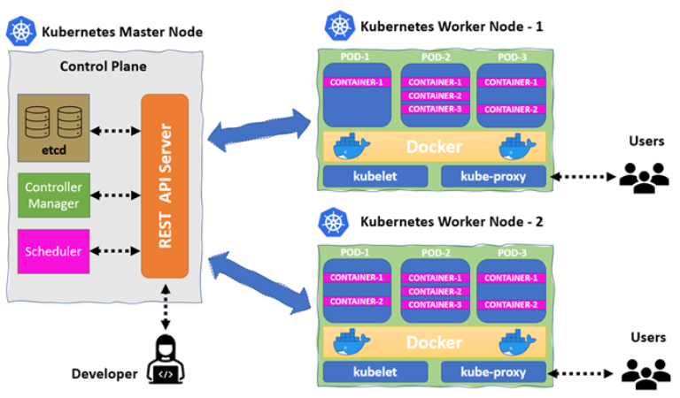

# 🍽️ Kubernetes como Restaurante de Alta Cocina

Entender la arquitectura de Kubernetes puede ser complejo. Para que sea más fácil, imaginemos que un clúster de Kubernetes es un **restaurante de alta cocina**. Cada componente tiene un rol específico para que el restaurante funcione sin problemas, desde tomar los pedidos hasta servir la comida en la mesa correcta.

> **Créditos:** Imagen cortesía del [Armosec Blog](https://www.armosec.io/blog/setting-up-kubernetes-cluster/).
---

## 🧠 El Control Plane — La Oficina Central

### 1. **API Server** → *El jefe de camareros*

* Es el punto central de coordinación del restaurante.
* Recibe todas las órdenes de los clientes (usuarios o herramientas externas como `kubectl`, CI/CD, etc.).
* Se comunica con la cocina y el personal para asegurarse de que cada pedido (deploy, update, scaling) se entienda y ejecute correctamente.

### 2. **etcd** → *El libro de contabilidad*

* Es la **fuente de la verdad** del restaurante.
* Guarda el estado completo del clúster: qué mesas (pods) están ocupadas, qué platos (servicios) se están sirviendo, qué ingredientes (config maps, secrets) están disponibles.
* Si todo falla, se puede reabrir el restaurante con solo este libro.

### 3. **Scheduler** → *El maître o asignador de mesas*

* Decide en qué mesa (nodo) se sentará cada cliente (pod).
* Considera el espacio libre, la capacidad del mesero (CPU/RAM), y preferencias especiales (taints, affinities).

### 4. **Controller Manager** → *El gerente del restaurante*

* Supervisa que todo funcione según lo planeado.
* Si algún pedido no se ha entregado, o falta personal, toma acciones para corregirlo.
* También se encarga de la interacción con servicios externos (como proveedores de nube).

---

## 🔥 Los Nodos — Las Cocinas Operativas

### 5. **Kubelet** → *El chef de estación*

* Cocina los pedidos asignados por el Scheduler.
* Se asegura de que cada receta (Pod) tenga los ingredientes necesarios (contenedores, volúmenes) y esté bien preparada.
* Reporta constantemente el estado de los platos al API Server.

### 6. **kube-proxy** → *El camarero o mensajero de platos*

* Se encarga del **enrutamiento del tráfico**.
* Asegura que si un cliente pide "pasta" (acceso a un servicio), el pedido llegue a la estación de cocina correcta, sin importar en qué nodo esté corriendo.

---

## 🎓 ¿Dónde encaja esto con casos reales?

Imagina que desarrollas una aplicación web con frontend, backend y base de datos:

* El desarrollador lanza una orden (deploy) con `kubectl`.
* El API Server recibe la solicitud y la anota en `etcd`.
* El Scheduler decide en qué nodos van a correr el frontend, backend y DB.
* El Kubelet de cada nodo descarga las imágenes y las pone a correr.
* `kube-proxy` asegura que el frontend pueda hablar con el backend, y el backend con la base de datos.

---

## 🔁 Tabla resumen

| Componente de Kubernetes | Rol en el restaurante       | Equivalente técnico          |
| ------------------------ | --------------------------- | ---------------------------- |
| Kubernetes cluster       | Restaurante completo        | Todo el ecosistema           |
| Control Plane            | Oficina de dirección        | Componentes de gestión       |
| API Server               | Jefe de camareros           | Punto de entrada de órdenes  |
| etcd                     | Libro de contabilidad       | Base de datos clave-valor    |
| Scheduler                | Maître / asignador de mesas | Planificador de Pods         |
| Controller Manager       | Gerente general             | Supervisor de estado deseado |
| Nodes                    | Estaciones de cocina        | Máquinas que ejecutan Pods   |
| Kubelet                  | Chef de cada estación       | Ejecuta y monitorea los Pods |
| kube-proxy               | Camarero / repartidor       | Enrutamiento de tráfico      |

---

