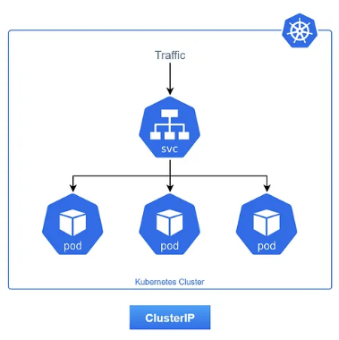

# 📦 ClusterIP Service: Acceso Interno al Clúster

> El tipo de Service por defecto en Kubernetes, diseñado para la comunicación interna entre tus aplicaciones.

---

## 🧠 ¿Qué es un ClusterIP Service?

Un Service de tipo **`ClusterIP`** expone tu conjunto de Pods en una **IP virtual interna** que solo es accesible desde otros Pods o Nodos dentro del mismo clúster de Kubernetes. No se expone directamente a la red externa.

Es la opción más común y el tipo por defecto cuando no especificas `type` en el manifiesto de un Service.

---

## ⚙️ Flujo de Tráfico y Funcionamiento

1.  **Solicitud Interna:** Un Pod (por ejemplo, tu frontend) necesita comunicarse con otro Pod (por ejemplo, tu backend). En lugar de usar la IP volátil del Pod de backend, el frontend hace una solicitud a la **`ClusterIP`** o al **nombre DNS interno** del Service del backend (ej. `mi-backend.mi-namespace.svc.cluster.local`).
2.  **Intercepción por `kube-proxy`:** Cada Nodo en tu clúster tiene un componente llamado **`kube-proxy`**. Este `kube-proxy` está constantemente observando los cambios en los Services y Endpoints de Kubernetes. Cuando detecta una solicitud dirigida a una `ClusterIP`, la intercepta.
3.  **Balanceo de Carga:** `kube-proxy` utiliza reglas de red (principalmente **`iptables`** o **`IPVS`** en Linux) para reescribir el destino del paquete. Redirige el tráfico a la IP y `targetPort` de uno de los Pods disponibles y `Ready` que el Service `ClusterIP` ha seleccionado. La selección del Pod se realiza mediante un algoritmo de balanceo de carga (generalmente round-robin).
4.  **Respuesta:** La respuesta del Pod sigue el camino inverso a través de `kube-proxy` y regresa al Pod solicitante.



---

## 🎯 Casos de Uso Ideales

* **Comunicación entre Microservicios:** La forma estándar para que los diferentes componentes de tu aplicación se hablen entre sí sin exponerse al exterior.
    * Ejemplo: Un servicio de autenticación (`ClusterIP`) es consumido por un servicio de usuario (`ClusterIP`).
* **Bases de Datos Internas:** Si tienes una base de datos o un caché corriendo en Pods de Kubernetes y no necesitas que sea accesible desde fuera del clúster, un `ClusterIP` es la opción segura.
* **Backends de Ingress:** Un `Ingress` típicamente enruta el tráfico externo a un Service de tipo `ClusterIP` interno.

---

## ✅ Ventajas

* **Seguridad:** Por su naturaleza, al ser interno, reduce la superficie de ataque de tus aplicaciones.
* **Estabilidad:** Ofrece una IP y nombre DNS estables a pesar de que los Pods subyacentes cambien o se escalen.
* **Simplicidad:** Es el tipo más sencillo de configurar y no requiere infraestructura externa.
* **Eficiencia:** El tráfico permanece dentro del clúster, lo que minimiza la latencia en la comunicación inter-servicio.

---

## ❌ Desventajas

* **No hay Acceso Directo Externo:** Por sí solo, un `ClusterIP` Service no es accesible desde fuera del clúster. Necesitarías un `NodePort`, `LoadBalancer` o un `Ingress` para exponerlo externamente.

---

## 📋 Ejemplo de Manifest

```yaml
apiVersion: v1
kind: Service
metadata:
  name: mi-backend-service
  labels:
    app: mi-aplicacion
spec:
  # Selector de etiquetas: el Service dirigirá el tráfico a Pods con esta etiqueta
  selector:
    app: mi-backend
  ports:
    - protocol: TCP
      port: 80       # El puerto en el Service (la ClusterIP)
      targetPort: 8080 # El puerto en el que la aplicación escucha dentro del Pod
  type: ClusterIP # Explicitamente declarado, aunque es el valor por defecto