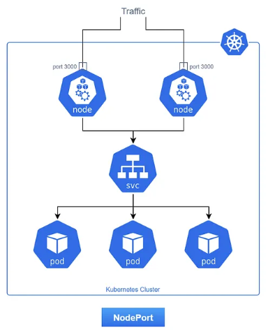

# 🚪 NodePort Service: Exposición Básica por Nodo

> Un tipo de Service que permite acceder a tus aplicaciones desde fuera del clúster a través de un puerto estático en cada Nodo.

-----

## 🧠 ¿Qué es un NodePort Service?

Un Service de tipo **`NodePort`** expone un Service de tipo `ClusterIP` por debajo asignando un **puerto estático** en cada Nodo (máquina virtual o física) de tu clúster de Kubernetes. Piensa en él como si abriera una "puerta" en cada Nodo, a través de la cual puedes acceder a tu aplicación.

Cualquier tráfico que llegue a este `NodePort` en **cualquier Nodo del clúster** será automáticamente redirigido al Service interno.

-----

## ⚙️ Flujo de Tráfico y Funcionamiento

1.  **Solicitud Externa:** Un cliente fuera del clúster (ej. tu navegador) intenta acceder a tu aplicación usando la **IP de cualquiera de tus Nodos** y el `NodePort` asignado (ej. `http://<IP_del_Nodo>:30080`).
2.  **Recepción en el Nodo:** El sistema operativo del Nodo recibe el tráfico en el `NodePort` específico.
3.  **Redirección por `kube-proxy`:** **`kube-proxy`** en ese Nodo (o cualquier otro Nodo que reciba el tráfico) intercepta la solicitud.
4.  **Balanceo de Carga Interno:** `kube-proxy` redirige el tráfico a la **`ClusterIP`** del Service interno asociado.
5.  **Envío al Pod:** Desde la `ClusterIP`, el tráfico se balancea a la IP y `targetPort` de uno de los Pods `Ready`.

Una característica clave es que el `NodePort` **se abre en *todos* los Nodos del clúster**, sin importar si los Pods del Service están corriendo en ese Nodo o no. Si el tráfico llega a un Nodo sin el Pod, `kube-proxy` se encargará de reenviarlo al Nodo correcto.



-----

## 🎯 Casos de Uso Ideales

  * **Entornos de Desarrollo y Pruebas:** Permite un acceso rápido y sencillo a las aplicaciones desde fuera del clúster sin necesidad de configurar un LoadBalancer. Es muy común en Minikube o K3s.
  * **Clústeres On-Premise sin LoadBalancer:** Si tu infraestructura no tiene un balanceador de carga dedicado (como los que ofrecen los proveedores de nube), `NodePort` puede ser una forma básica de exponer servicios.
  * **Detrás de un Balanceador de Carga Existente:** Puedes configurar un balanceador de carga externo (hardware o software) para que apunte a los `NodePort`s de tus Nodos de Kubernetes, usando el balanceador para la IP pública y la gestión de certificados.

-----

## ✅ Ventajas

  * **Simplicidad:** Es relativamente fácil de configurar.
  * **Universal:** Funciona en cualquier entorno de Kubernetes, independientemente del proveedor de nube.
  * **Acceso Básico Externo:** Permite acceder a los servicios desde fuera del clúster.

-----

## ❌ Desventajas

  * **Rango de Puertos Restringido:** Los `NodePort`s se asignan desde un rango predefinido (por defecto 30000-32767). Esto puede causar conflictos si tienes muchos servicios o necesitas puertos específicos.
  * **Problemas de Escalabilidad:** No está diseñado para un tráfico de producción alto. No ofrece funcionalidades avanzadas como terminación SSL, persistencia de sesión o algoritmos de balanceo avanzados.
  * **Dependencia de la IP del Nodo:** Si la IP de tus Nodos cambia (común en entornos dinámicos), el acceso externo se rompe. Necesitas un mecanismo adicional (como un LoadBalancer externo) para una IP estable.
  * **Múltiples Nodos, Múltiples IPs:** Si tienes varios Nodos, cada uno tendrá la misma aplicación expuesta en el mismo `NodePort`, pero en su propia IP. Esto puede ser confuso para los clientes externos.
  * **Un Puerto por Servicio por Clúster:** No puedes tener dos Services diferentes usando el mismo `NodePort` en el mismo clúster.

-----

## 📋 Ejemplo de Manifest

Aquí tienes un ejemplo completo de un Deployment y un Service de tipo `NodePort` para una aplicación simple:

```yaml
# deployment-hello-nodeport.yaml
apiVersion: apps/v1
kind: Deployment
metadata:
  name: hello-deployment-np
  labels:
    app: hello
spec:
  replicas: 2
  selector:
    matchLabels:
      app: hello-nodeport # Este selector debe coincidir con las etiquetas del Pod
  template:
    metadata:
      labels:
        app: hello-nodeport # Estas etiquetas identifican los Pods para el Service
    spec:
      containers:
        - name: hello-app
          image: gcr.io/google-samples/hello-app:1.0
          ports:
            - containerPort: 8080 # El puerto en el que la aplicación escucha dentro del Pod

---

apiVersion: v1
kind: Service
metadata:
  name: hello-service-np
spec:
  type: NodePort # Define el tipo de Service como NodePort
  selector:
    app: hello-nodeport # El selector debe coincidir con las etiquetas del Pod del Deployment
  ports:
    - port: 80       # El puerto que el Service expone internamente (ClusterIP)
      targetPort: 8080 # El puerto al que el Service envía el tráfico dentro del Pod
      nodePort: 30007 # El puerto estático que se abre en cada Nodo (opcional, si no se especifica, Kubernetes asigna uno)
```

**Explicación del Ejemplo:**

1.  **Deployment (`hello-deployment-np`):**
      * Crea 2 réplicas de Pods.
      * Cada Pod ejecuta la imagen `gcr.io/google-samples/hello-app:1.0`.
      * La aplicación `hello-app` dentro del Pod escucha en el puerto `8080`.
      * Los Pods tienen la etiqueta `app: hello-nodeport`.
2.  **Service (`hello-service-np`):**
      * Es de tipo `NodePort`.
      * Usa el selector `app: hello-nodeport` para encontrar los Pods del Deployment.
      * Expone el puerto `80` internamente (como un `ClusterIP`).
      * Redirige el tráfico del puerto `80` al `targetPort: 8080` de los Pods.
      * Asigna el `nodePort: 30007` en cada Nodo del clúster.

-----

## 🛠️ Comandos Útiles para NodePort

Aquí tienes los comandos clave para trabajar y depurar un Service de tipo `NodePort`:

1.  **Aplicar los manifiestos:**

    ```bash
    kubectl apply -f deployment-hello-nodeport.yaml
    kubectl apply -f service-hello-nodeport.yaml
    ```

2.  **Verificar el estado del Service:**

    ```bash
    kubectl get svc hello-service-np
    ```

      * **Salida esperada:** Verás el `TYPE` como `NodePort`, el `CLUSTER-IP` asignado, y los `PORT(S)` mostrando `80:30007/TCP`. El `30007` es el `NodePort` que se abrió en cada Nodo.

    <!-- end list -->

    ```
    NAME               TYPE       CLUSTER-IP      EXTERNAL-IP   PORT(S)         AGE
    hello-service-np   NodePort   10.100.200.50   <none>        80:30007/TCP    15s
    ```

3.  **Obtener la IP de Minikube (si usas Minikube):**
    Necesitas la IP de tu Nodo (en Minikube, es la IP de la VM de Minikube) para acceder al `NodePort`.

    ```bash
    minikube ip
    ```

      * **Ejemplo de salida:** `192.168.49.2`

4.  **Acceder a la aplicación desde fuera del clúster:**
    Una vez que tengas la IP de Minikube y el `NodePort` (30007 en este ejemplo), puedes acceder a tu aplicación:

      * **Desde el navegador:** Abre `http://<IP_DE_MINIKUBE>:30007` (ej. `http://192.168.49.2:30007`)
      * **Desde la terminal con `curl`:**
        ```bash
        curl http://$(minikube ip):30007
        ```
          * **Salida esperada:** `Hello, world! Version: 1.0.0 Hostname: hello-deployment-np-xxxx`

5.  **Depurar el flujo de tráfico (Capa de Transporte):**
    Si no puedes acceder, verifica que el puerto 30007 esté realmente abierto y escuchando en tu Nodo (o en tu máquina host si es Minikube):

      * **En Linux (si SSH al Nodo):**
        ```bash
        sudo netstat -tulnp | grep 30007
        ```
      * **En Windows (en tu máquina host, para Minikube):**
        ```cmd
        netstat -ano | findstr :30007
        ```
          * **Deberías ver:** Un proceso escuchando en `0.0.0.0:30007` (o `127.0.0.1:30007` si el driver de Minikube lo mapea así). Si no ves nada, el `NodePort` no se está exponiendo correctamente.

6.  **Verificar los Endpoints del Service:**
    Asegúrate de que el Service esté seleccionando correctamente los Pods y que estos estén `Ready`.

    ```bash
    kubectl get endpoints hello-service-np
    ```

      * **Salida esperada:** Verás las IPs de los Pods y sus `targetPort` (8080). Si no hay IPs, los Pods no están listos o el selector es incorrecto.

7.  **Limpieza (opcional):**

    ```bash
    kubectl delete svc hello-service-np
    kubectl delete deployment hello-deployment-np
    ```

-----