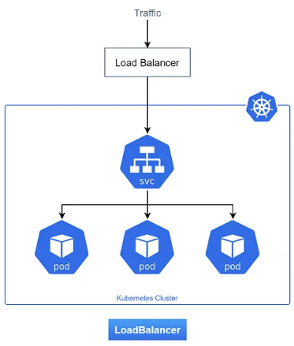

-----

# ☁️ LoadBalancer Service: Exposición Externa Gestionada por la Nube

> El tipo de Service que integra Kubernetes con la infraestructura de balanceo de carga de tu proveedor de nube para exponer tus aplicaciones de forma robusta y escalable.

-----

## 🧠 ¿Qué es un LoadBalancer Service?

Un Service de tipo **`LoadBalancer`** es la forma estándar de exponer servicios a internet en clústeres de Kubernetes desplegados en proveedores de nube compatibles (como AWS, Azure, Google Cloud Platform, DigitalOcean, etc.). Al crear un Service de este tipo, Kubernetes interactúa con la API del proveedor de la nube para **provisionar automáticamente un balanceador de carga externo** dedicado para tu Service.

Este balanceador de carga externo recibe el tráfico de internet y lo distribuye a los nodos de tu clúster.

-----

## ⚙️ Flujo de Tráfico y Funcionamiento

1.  **Provisionamiento del LoadBalancer:** Cuando aplicas un manifiesto de Service con `type: LoadBalancer`, el **Cloud Controller Manager** de Kubernetes (un componente que se ejecuta en el clúster) detecta esta solicitud. Luego, se comunica con la API de tu proveedor de nube para crear un balanceador de carga (ej. un ELB en AWS, un Load Balancer en Azure, un Network Load Balancer en GCP).
2.  **Asignación de IP/DNS:** El balanceador de carga de la nube obtiene una **dirección IP pública estable** (o un nombre DNS) que es accesible desde internet. Esta IP se muestra en la salida de `kubectl get svc`.
3.  **Configuración del Target:** Internamente, el Service de tipo `LoadBalancer` también crea un **`NodePort`** en cada Nodo del clúster. El balanceador de carga de la nube se configura para enviar el tráfico a los `NodePort`s de todos los Nodos del clúster. Esto significa que el tráfico del balanceador de carga puede llegar a cualquier Nodo.
4.  **Redirección por `kube-proxy`:** Una vez que el tráfico llega a un Nodo a través de su `NodePort`, `kube-proxy` en ese Nodo lo intercepta.
5.  **Balanceo de Carga Interno:** `kube-proxy` redirige el tráfico a la `ClusterIP` del Service interno asociado.
6.  **Envío al Pod:** Finalmente, la `ClusterIP` balancea la carga a la IP y `targetPort` de uno de los Pods `Ready` que el Service está gestionando.



-----

## 🎯 Casos de Uso Ideales

  * **Exposición de Aplicaciones Públicas:** La forma principal de exponer aplicaciones web, APIs RESTful, o cualquier servicio TCP/UDP al público en un entorno de nube.
  * **Servicios de Alto Tráfico:** Se beneficia de la escalabilidad y resiliencia de los balanceadores de carga gestionados por la nube.
  * **Integración Transparente:** Proporciona una IP pública fija y estable que se integra a la perfección con sistemas DNS externos.

-----

## ✅ Ventajas

  * **Simplicidad para el Usuario:** Kubernetes y el proveedor de nube manejan automáticamente la complejidad del balanceador de carga. Tú solo especificas el tipo.
  * **Escalabilidad y Fiabilidad:** Aprovecha las características robustas de los balanceadores de carga nativos de la nube (alta disponibilidad, auto-escalado, health checks).
  * **IP Pública Estable:** Obtienes una IP (o DNS) externa que no cambia, facilitando la configuración de registros DNS.
  * **Balanceo de Carga Avanzado:** Muchos balanceadores de carga de nube ofrecen funcionalidades adicionales como terminación SSL/TLS, reglas de enrutamiento basadas en contenido y protección DDoS.

-----

## ❌ Desventajas

  * **Costo:** Los balanceadores de carga en la nube suelen tener un costo asociado, que puede ser significativo para muchos servicios.
  * **Dependencia del Proveedor de Nube:** Este tipo de Service solo funciona con proveedores de nube que implementen el Cloud Controller Manager de Kubernetes. No es adecuado para clústeres on-premise sin una solución de balanceo de carga externa integrada.
  * **Menos Control HTTP/S (Directo):** Para enrutamiento más complejo basado en HTTP (ej. múltiples dominios o rutas a diferentes servicios, terminación SSL centralizada), un **Ingress** es generalmente la opción preferida. Un `LoadBalancer` a menudo se usa para exponer el Ingress Controller.

-----

## 📋 Ejemplo de Manifest

```yaml
apiVersion: v1
kind: Service
metadata:
  name: mi-api-publica
  labels:
    app: mi-aplicacion
spec:
  # Selector de etiquetas: el Service dirigirá el tráfico a Pods con esta etiqueta
  selector:
    app: mi-api
  ports:
    - protocol: TCP
      port: 80       # El puerto que el LoadBalancer expone (y que balancea a los NodePorts)
      targetPort: 8080 # El puerto en el que la aplicación escucha dentro del Pod
  type: LoadBalancer # Declara explícitamente el tipo LoadBalancer
```

Después de aplicar este manifiesto, al ejecutar `kubectl get svc mi-api-publica`, verás una **`EXTERNAL-IP`** asignada, que es la IP pública de tu balanceador de carga en la nube. Puedes acceder a tu servicio a través de esa IP o configurarle un nombre de dominio personalizado.

-----