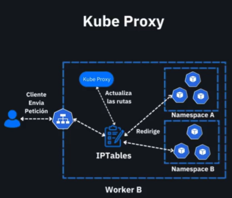

# 🧩 kube-proxy

## 📌 ¿Qué es `kube-proxy`?

`kube-proxy` es un componente clave del plano de datos de Kubernetes que corre en cada nodo del clúster. Su función principal es garantizar el **enrutamiento del tráfico de red** a los Pods adecuados, gestionando el acceso a los **Servicios (Services)** de Kubernetes.

## ⚙️ ¿Qué hace kube-proxy?

* Mantiene las **reglas de red** (iptables o IPVS) actualizadas para enrutar el tráfico hacia los Pods que implementan un Servicio.
* Redirige el tráfico entrante desde el exterior del clúster o desde otros Pods hacia el destino adecuado.
* Soporta balanceo de carga a nivel de red entre Pods del mismo Servicio.

## 🧠 Funcionamiento (basado en el diagrama)



1. 🧍‍♂️ Un **cliente externo o interno** (otro pod o usuario) realiza una petición a un Servicio.
2. 📥 La petición llega al nodo (ej. Worker B).
3. 🔄 `kube-proxy` se encarga de **actualizar las rutas de red** usando `iptables`.
4. 🧭 `iptables` redirige la petición hacia uno de los Pods que forman parte del Servicio, sin que el cliente tenga que conocer la IP de cada Pod.
5. 📦 La petición es entregada al Pod adecuado, que puede estar en cualquier `Namespace`.

> En el diagrama se muestra cómo `kube-proxy` trabaja junto a `iptables` para enrutar peticiones hacia Pods distribuidos en diferentes `Namespaces`, asegurando el balanceo y la entrega correcta.

---

## 📎 Modos de operación

* **iptables (por defecto)**: usa reglas del kernel de Linux para enrutar tráfico.
* **ipvs**: alternativa más eficiente en entornos de alta escala.
* **userspace (obsoleto)**: menos eficiente, sólo para propósitos educativos o ambientes muy antiguos.

---

## 📌 Comandos útiles

```bash
# Verificar el estado de kube-proxy en los nodos
kubectl get daemonset kube-proxy -n kube-system

# Ver logs del kube-proxy en un nodo específico
kubectl logs -n kube-system -l k8s-app=kube-proxy
```

