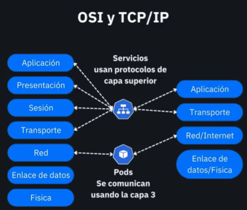

# Modelos de Red OSI y TCP/IP en Kubernetes: Guía para Desarrolladores

> Una explicación práctica de cómo los modelos clásicos de red se aplican en el ecosistema de contenedores moderno



---

## Resumen inicial

Los modelos OSI y TCP/IP son los fundamentos teóricos que rigen toda comunicación de red, incluyendo la que ocurre dentro de un clúster de Kubernetes. Aunque estos modelos fueron diseñados décadas antes de la containerización, siguen siendo la base sobre la cual operan los Pods, Services y toda la infraestructura de red de Kubernetes. Comprender esta relación te permitirá diagnosticar problemas de conectividad, optimizar el rendimiento y diseñar arquitecturas de microservicios más robustas.

---

## ¿Qué problema resuelve?

En un clúster de Kubernetes, miles de contenedores necesitan comunicarse entre sí de manera eficiente y confiable. Sin un modelo de red estructurado, esta comunicación sería caótica. Los desarrolladores enfrentan desafíos como:

- **Comunicación inter-Pod**: ¿Cómo puede un Pod en un nodo comunicarse con otro Pod en un nodo diferente?
- **Descubrimiento de servicios**: ¿Cómo encuentra una aplicación a sus dependencias sin conocer IPs específicas?
- **Balanceo de carga**: ¿Cómo distribuir tráfico entre múltiples instancias de un servicio?
- **Aislamiento y seguridad**: ¿Cómo controlar qué servicios pueden comunicarse entre sí?

Los modelos OSI y TCP/IP proporcionan el marco conceptual que Kubernetes utiliza para resolver estos problemas de manera consistente y escalable.

---

## ¿Cómo funciona?

### El Modelo OSI en Kubernetes

**Analogía**: Piensa en el modelo OSI como las capas de un edificio de oficinas. Cada piso tiene una función específica, y la información debe pasar por todos los pisos para llegar de un extremo al otro.

| Capa OSI | Nombre | En Kubernetes | Analogía |
|----------|--------|---------------|----------|
| 7 | Aplicación | Tu código HTTP/gRPC/REST | El departamento de ventas (interactúa con clientes) |
| 6 | Presentación | TLS/SSL, JSON, Protobuf | Traducción/formateo (traduce idiomas) |
| 5 | Sesión | Conexiones persistentes, tokens JWT | Recepción (maneja citas y sesiones) |
| 4 | Transporte | TCP/UDP en Services | Elevadores (garantizan entrega confiable) |
| 3 | Red | IPs de Pods, enrutamiento CNI | Sistema de direcciones del edificio |
| 2 | Enlace | Interfaces de red del nodo | Pasillos y conexiones físicas |
| 1 | Física | Hardware de red, cables | Infraestructura física del edificio |

### El Modelo TCP/IP Simplificado

TCP/IP agrupa las capas OSI en 4 niveles más prácticos:

```
┌─────────────────┐
│   Aplicación    │ ← Tu código, APIs REST, gRPC
│   (Capas 5-7)   │
├─────────────────┤
│   Transporte    │ ← Services, TCP/UDP ports
│   (Capa 4)      │
├─────────────────┤
│   Red/Internet  │ ← Pod IPs, ClusterIP, enrutamiento
│   (Capa 3)      │
├─────────────────┤
│ Enlace/Física   │ ← CNI plugins, nodos físicos
│ (Capas 1-2)     │
└─────────────────┘
```

### Flujo de Comunicación Paso a Paso

1. **Tu aplicación** (Capa 7) hace una llamada HTTP a otro servicio
2. **Kubernetes DNS** resuelve el nombre del Service a una ClusterIP
3. **kube-proxy** (Capa 4) intercepta la conexión y selecciona un Pod backend
4. **El CNI plugin** (Capa 3) enruta el paquete a través de la red del clúster
5. **La interfaz de red** (Capas 1-2) transmite físicamente los datos
6. El proceso se repite en reversa para la respuesta

---

## Relación con otros componentes

### Mapeo completo de componentes por capa:

| Capa | Modelo OSI | Modelo TCP/IP | Componentes Kubernetes | Función principal |
|------|------------|---------------|------------------------|-------------------|
| 7 | Aplicación | Aplicación | Pod → App, Ingress Controllers, CoreDNS | Lógica de negocio, HTTP/gRPC, resolución DNS |
| 6 | Presentación | Aplicación | TLS entre Pods, cert-manager | Cifrado, compresión, serialización |
| 5 | Sesión | Aplicación | TLS handshake, conexiones WebSocket | Gestión de sesiones y estado de conexión |
| 4 | Transporte | Transporte | Services, kube-proxy, iptables | Balanceo de carga TCP/UDP, NAT |
| 3 | Red | Internet | Pod IPs, CNI plugins, NetworkPolicies | Enrutamiento, direccionamiento IP, políticas |
| 2 | Enlace | Enlace | Interfaces veth, bridges virtuales | Conectividad L2, switching virtual |
| 1 | Física | Física | NICs del nodo, kubelet (config interfaces) | Hardware de red, conectividad física |

### Interacciones clave entre componentes:

- **kubelet** (Capas 3-7): Orquesta la configuración de red del Pod y gestiona el runtime
- **kube-proxy** (Capa 4): Implementa Services mediante reglas iptables/IPVS para balanceeo
- **CNI Plugin** (Capas 2-3): Configura interfaces de red, asigna IPs y establece rutas
- **CoreDNS** (Capa 7): Traduce nombres de Services a ClusterIPs
- **NetworkPolicy** (Capas 3-4): Define reglas de firewall entre Pods a nivel de red y transporte

---

## Referencias visuales

El diagrama `osi-tcp-ip.png` ilustra:

- **Lado izquierdo**: Las 7 capas del modelo OSI con ejemplos específicos de protocolos
- **Lado derecho**: Las 4 capas del modelo TCP/IP con su equivalencia OSI
- **Centro**: Mapeo visual de cómo se corresponden ambos modelos
- **Íconos**: Representaciones gráficas de cada capa (aplicación, transporte, red, física)

Esta visualización te ayuda a ubicar mentalmente dónde opera cada componente de Kubernetes dentro del stack de red completo.

---

## Comandos relacionados

### Diagnóstico sistemático por capas

Entender en qué capa estás trabajando te permite diagnosticar problemas de forma eficiente y dirigida.

#### Capa 7 (Aplicación) - Lógica de negocio
**Síntomas**: El Pod responde, pero con errores HTTP 4xx/5xx, timeouts de aplicación, datos malformados

```bash
# Ver logs de aplicación
kubectl logs <pod-name> -f

# Probar endpoints HTTP
kubectl exec -ti <pod-name> -- curl -v http://<service>:<port>/health

# Testing gRPC
kubectl exec -ti <pod-name> -- grpcurl -plaintext <service>:<port> list

# Verificar variables de entorno
kubectl exec -ti <pod-name> -- env | grep -i config
```

#### Capa 6 (Presentación) - Cifrado y formato
**Síntomas**: Errores de certificados TLS, problemas de serialización JSON/protobuf

```bash
# Verificar certificados TLS
kubectl exec -ti <pod-name> -- openssl s_client -connect <service>:443

# Ver secretos TLS
kubectl get secret <tls-secret> -o yaml

# Probar formato de datos
kubectl exec -ti <pod-name> -- curl -H "Content-Type: application/json" <service>
```

#### Capa 5 (Sesión) - Estado de conexión
**Síntomas**: Conexiones que se cortan, problemas con WebSockets, sesiones perdidas

```bash
# Ver conexiones activas
kubectl exec -ti <pod-name> -- netstat -an | grep ESTABLISHED

# Probar conexiones persistentes
kubectl exec -ti <pod-name> -- curl -H "Connection: keep-alive" <service>
```

#### Capa 4 (Transporte) - Services y puertos
**Síntomas**: "Connection refused", puertos cerrados, problemas de balanceeo

```bash
# Probar conectividad TCP
kubectl exec -ti <pod-name> -- telnet <service> <port>

# Ver puertos en escucha
kubectl exec -ti <pod-name> -- ss -lnt

# Inspeccionar endpoints de Services
kubectl get endpoints <service-name>

# Ver configuración de kube-proxy
kubectl logs -n kube-system -l k8s-app=kube-proxy

# Verificar reglas iptables (en nodo)
sudo iptables -t nat -L | grep <service>
```

#### Capa 3 (Red) - Enrutamiento e IPs
**Síntomas**: "Network unreachable", problemas de enrutamiento, IPs no alcanzables

```bash
# Probar conectividad de red
kubectl exec -ti <pod-name> -- ping <pod-ip>

# Trazar ruta de red
kubectl exec -ti <pod-name> -- traceroute <pod-ip>

# Ver rutas de red
kubectl exec -ti <pod-name> -- ip route show

# Verificar resolución DNS
kubectl exec -ti <pod-name> -- nslookup <service-name>

# Ver configuración de Pod
kubectl get pod <pod-name> -o wide
```

#### Capa 2 (Enlace) - Interfaces virtuales
**Síntomas**: Problemas de conectividad L2, interfaces mal configuradas

```bash
# Ver interfaces de red
kubectl exec -ti <pod-name> -- ip link show

# Información de bridges (en nodo)
sudo bridge link show

# Ver configuración de interfaces virtuales
sudo ip link show type veth
```

#### Capa 1 (Física) - Hardware de nodo
**Síntomas**: Pérdida de paquetes, problemas de MTU, fallos de hardware

```bash
# Ver estadísticas de interfaz física (en nodo)
sudo ethtool eth0

# Verificar MTU
kubectl exec -ti <pod-name> -- ip link show | grep mtu

# Ver logs del sistema (en nodo)
sudo journalctl -u kubelet | grep -i network
```

### Herramientas avanzadas de debugging

#### Netshoot - Kit completo de herramientas de red
```bash
# Pod temporal con herramientas de debugging
kubectl run netshoot --rm -ti --image=nicolaka/netshoot -- bash

# Herramientas incluidas: tcpdump, dig, iftop, nc, curl, ping, traceroute, etc.
```

#### Ephemeral containers - Debug sin modificar Pods
```bash
# Adjuntar container de debug a Pod existente
kubectl debug -it <pod-name> --image=nicolaka/netshoot --target=<container-name>

# Compartir namespace de red con el Pod original
kubectl debug <pod-name> --image=nicolaka/netshoot --share-processes
```

#### Análisis de tráfico avanzado
```bash
# Capturar tráfico desde un Pod
kubectl exec -ti <pod-name> -- tcpdump -i any -w capture.pcap

# Monitorear conexiones en tiempo real
kubectl exec -ti <pod-name> -- iftop -i eth0

# Ver estadísticas de red detalladas
kubectl exec -ti <pod-name> -- ss -i
```

---

## Notas para desarrolladores

### Metodología de debugging por capas

Cuando tengas problemas de conectividad, sigue este enfoque sistemático de abajo hacia arriba:

1. **¿Hay conectividad física?** (Capa 1) → Verificar nodos y hardware
2. **¿Las interfaces están configuradas?** (Capa 2) → Revisar CNI y veth
3. **¿Hay conectividad IP?** (Capa 3) → Probar ping entre Pods
4. **¿Los puertos están abiertos?** (Capa 4) → Verificar Services y endpoints
5. **¿El protocolo funciona?** (Capa 7) → Probar HTTP/gRPC específicamente

### Lo que DEBES saber por capa:

#### Capa 7 (Aplicación)
```yaml
# ❌ Malo - hardcodear URLs
env:
  - name: API_URL
    value: "http://10.244.1.15:8080"

# ✅ Bueno - usar Service DNS
env:
  - name: API_URL
    value: "http://mi-servicio.mi-namespace.svc.cluster.local:8080"
```

#### Capa 4 (Transporte)
- **ClusterIP**: Solo acceso interno al clúster
- **NodePort**: Expone en puerto del nodo (30000-32767)  
- **LoadBalancer**: Para exposición externa con balanceador
- **ExternalName**: Para servicios externos al clúster

#### Capa 3 (Red)
- Los Pods obtienen IPs del rango CIDR del clúster
- Cada nodo tiene su propio subnet para Pods
- NetworkPolicies controlan tráfico entre Pods

### Patrones de debugging comunes:

#### "Connection refused" (Capa 4)
```bash
# 1. ¿El Service existe y tiene endpoints?
kubectl get svc,endpoints <service-name>

# 2. ¿El puerto es correcto?
kubectl describe svc <service-name>

# 3. ¿El Pod está corriendo y saludable?
kubectl get pods -l app=<label-selector>
```

#### "Name resolution failed" (Capa 7)
```bash
# 1. ¿El DNS funciona?
kubectl exec -ti <pod> -- nslookup kubernetes.default

# 2. ¿El nombre del Service es correcto?
kubectl get svc -A | grep <service-name>

# 3. ¿Estás en el namespace correcto?
kubectl exec -ti <pod> -- nslookup <service>.<namespace>.svc.cluster.local
```

#### "Timeout" (Capas 3-4)
```bash
# 1. ¿Hay conectividad básica?
kubectl exec -ti <pod> -- ping <target-ip>

# 2. ¿NetworkPolicies están bloqueando?
kubectl get networkpolicy -A

# 3. ¿kube-proxy está funcionando?
kubectl get pods -n kube-system -l k8s-app=kube-proxy
```

### Buenas prácticas por capa:

#### Capa 7 (Aplicación)
- Implementa health checks (`/health`, `/ready`)
- Usa circuit breakers para servicios externos
- Configura timeouts apropiados
- Log errores con contexto suficiente

#### Capa 4 (Transporte)  
- Define livenessProbe y readinessProbe
- Usa nombres de Services en lugar de IPs
- Configura resource limits para evitar exhaustion
- Implementa graceful shutdown

#### Capa 3 (Red)
- Usa NetworkPolicies para microsegmentación
- Monitorea métricas de red (latencia, throughput)
- Considera políticas de QoS para tráfico crítico

### Kit de emergencia para desarrolladores:

```bash
# Pod de debugging con todas las herramientas
kubectl apply -f - <<EOF
apiVersion: v1
kind: Pod
metadata:
  name: debug-toolkit
spec:
  containers:
  - name: toolkit
    image: nicolaka/netshoot
    command: ["/bin/bash"]
    args: ["-c", "sleep 3600"]
    resources:
      requests:
        cpu: 100m
        memory: 128Mi
EOF

# Acceder al toolkit
kubectl exec -ti debug-toolkit -- bash

# Limpiar cuando termines
kubectl delete pod debug-toolkit
```

### Errores típicos y sus capas:

| Error | Capa | Causa probable | Solución |
|-------|------|----------------|----------|
| `connection refused` | 4 | Puerto cerrado, Service mal configurado | Revisar Service y endpoints |
| `no route to host` | 3 | Problema de enrutamiento, NetworkPolicy | Verificar conectividad IP |
| `name resolution failed` | 7 | DNS no funciona, nombre incorrecto | Probar nslookup, verificar Service |
| `timeout` | 3-4 | Red lenta, firewall, recursos agotados | top, iftop, verificar recursos |
| `certificate error` | 6 | TLS mal configurado, certificados vencidos | Verificar Secrets, cert-manager |
| `404 not found` | 7 | Ruta incorrecta, aplicación no corriendo | Revisar logs, health checks |

### Para equipos DevOps:

- Establece alertas en métricas de red de cada capa
- Documenta el mapeo de Services por aplicación  
- Usa herramientas como Istio para observabilidad de Capa 7
- Implementa chaos engineering para probar resiliencia de red

---

## Recursos adicionales

- [Kubernetes Networking Concepts](https://kubernetes.io/docs/concepts/cluster-administration/networking/)
- [CNI Specification](https://github.com/containernetworking/cni)
- [Understanding kube-proxy](https://kubernetes.io/docs/concepts/services-networking/service/#virtual-ips-and-service-proxies)
- [NetworkPolicy Guide](https://kubernetes.io/docs/concepts/services-networking/network-policies/)