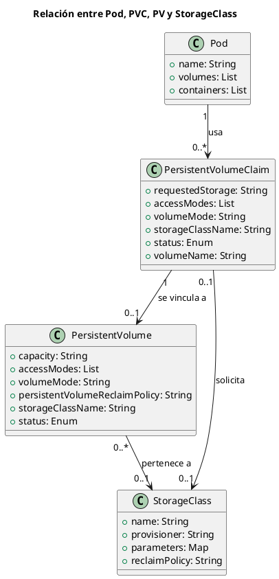

# 🧩 Analogía y modelo entre Pod, PVC, PV y StorageClass

## 🎯 Objetivo

Comprender la interacción entre los componentes clave del almacenamiento persistente en Kubernetes:
**Pod**, **PersistentVolumeClaim (PVC)**, **PersistentVolume (PV)** y **StorageClass**,
usando una **analogía conceptual** y un **modelo UML con cardinalidad**.

---

## 🍽️ Analogía: Restaurante y mesas

Imaginemos Kubernetes como un **restaurante**:

| Componente       | Analogía real           | Rol                                                         |
| ---------------- | ----------------------- | ----------------------------------------------------------- |
| **Pod**          | Cliente                 | Quiere una mesa para comer.                                 |
| **PVC**          | Solicitud de reserva    | El cliente pide una mesa para cierto número de personas.    |
| **PV**           | Mesa disponible         | El restaurante tiene varias mesas con capacidad definida.   |
| **StorageClass** | Sección del restaurante | Área con características particulares (ventana, VIP,terraza, interior, etc.). |

**Flujo completo**:

1. El **cliente (Pod)** no elige la mesa directamente.
2. Hace una **solicitud (PVC)** indicando lo que necesita: tamaño, tipo, ubicación (StorageClass).
3. El **restaurante (Kubernetes)** busca una **mesa (PV)** que cumpla los requisitos.
4. Si existe una mesa compatible, se hace el **binding** entre la reserva y la mesa (PVC → PV).
5. Si no hay mesas disponibles pero se indica una **StorageClass**, Kubernetes puede crear la mesa automáticamente (aprovisionamiento dinámico).

---

## 🧭 Modelo de clases UML con PlantUML

A continuación se muestra un diagrama de clases en [plantUML](https://www.plantuml.com/plantuml/uml/) que representa estas relaciones en Kubernetes:

---

### 🔍 Interpretación del modelo

| Relación               | Explicación                                                                                                                  |
| ---------------------- | ---------------------------------------------------------------------------------------------------------------------------- |
| `Pod --> PVC`          | Un Pod puede usar varias PVCs, o ninguna. Cada volumen declarado por el Pod puede apuntar a una PVC.                         |
| `PVC --> PV`           | Una PVC puede vincularse a un PV (binding), pero puede estar sin vínculo si no hay uno disponible.                           |
| `PV --> StorageClass`  | Un PV puede haber sido creado con un StorageClass (dinámicamente o manualmente). No es obligatorio.                          |
| `PVC --> StorageClass` | Una PVC puede especificar un `storageClassName`, lo cual dispara el aprovisionamiento dinámico o selecciona un PV existente. |

---

---

## 🧠 Claves para recordar

* Un **Pod** no se enlaza directamente a un PV, siempre lo hace a través de un **PVC**.
* El **PVC** actúa como contrato o intermediario entre el Pod y el almacenamiento.
* Un **StorageClass** define cómo y con qué parámetros debe crearse el almacenamiento.
* La cardinalidad ayuda a entender que múltiples Pods pueden hacer múltiples claims, y que un solo StorageClass puede estar asociado a múltiples volúmenes.

---

## ✅ ¿Cuándo usar cada componente?

| Situación                                                             | ¿Qué usar?                                                                     |
| --------------------------------------------------------------------- | ------------------------------------------------------------------------------ |
| Quieres almacenamiento temporal para un Pod.                          | Usa `emptyDir` directamente.                                                   |
| Necesitas persistencia pero puedes manejar manualmente los volúmenes. | Crea un PV manual y una PVC enlazada (modo `hostPath`).                        |
| Deseas que Kubernetes maneje el ciclo de vida del volumen.            | Define una PVC con `storageClassName` y permite el aprovisionamiento dinámico. |

