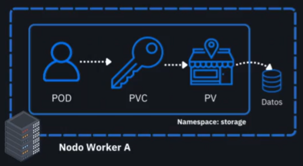

### **Analogía del restaurante**

Para entender mejor los conceptos, hemos comparado la arquitectura de Kubernetes con un **restaurante de alta cocina**. En esta analogía:

* El **clúster de Kubernetes** es el **restaurante completo**.
* Los **Nodos** son las **estaciones de cocina** donde se prepara la comida.
* Los **Pods** son los **cocineros** que trabajan en esas estaciones.
* El **Control Plane** (Scheduler, Controller Manager) es la **gerencia del restaurante** que organiza y coordina todo.

En este contexto, los cocineros (`Pods`) necesitan un lugar para guardar y acceder a sus ingredientes de manera segura y confiable. Para ello, el restaurante cuenta con un sistema de almacenes y llaves, que es precisamente la función de los **PersistentVolumes (PVs)** y los **PersistentVolumeClaims (PVCs)**.

---

### PV y PVC: El Almacén y la Llave de Acceso en Nuestra Cocina

Continuando con la analogía de nuestro restaurante, si los **Pods** son los cocineros y los **Nodos** son las estaciones de la cocina, entonces los **PersistentVolumes (PVs)** y los **PersistentVolumeClaims (PVCs)** son la gestión del almacén de ingredientes.

Se trata de un sistema que separa la responsabilidad del **almacén físico** de la **necesidad del cocinero**, asegurando que los ingredientes nunca se pierdan, sin importar qué cocinero los esté usando.

---

#### 1. PersistentVolume (PV): El Almacén de Ingredientes

Observa en la imagen el icono de la **tienda/almacén** con el nombre **PV**.

Este es el **almacén físico** de nuestro restaurante, donde se guardan todos los ingredientes (los **Datos**). El administrador del restaurante (el clúster) ha preparado este almacén de antemano. Él es quien define sus características:

* **Capacidad:** "El almacén tiene 10 metros cuadrados de espacio".
* **Acceso:** "Solo puede entrar un cocinero a la vez" o "varios cocineros pueden entrar a leer, pero solo uno puede escribir".

El almacén (`PV`) existe independientemente de si algún cocinero lo está usando o no. Simplemente está ahí, disponible en el restaurante para quien lo necesite.

---

#### 2. PersistentVolumeClaim (PVC): La Solicitud y la Llave de Acceso

Ahora mira la imagen y fíjate en el **cocinero (`POD`)** y la **llave (`PVC`)** que tiene en su mano.

El cocinero (`POD`) no conoce la ubicación exacta del almacén ni sus detalles internos. En lugar de preocuparse por eso, simplemente le pide al gerente una **llave** para un tipo específico de almacenamiento. Por ejemplo: "Necesito una llave para un almacén con al menos 5 metros cuadrados de espacio para guardar mis ingredientes".

Esa solicitud es el **PersistentVolumeClaim (PVC)**. Es la **llave de acceso** que el cocinero pide. La llave (`PVC`) no es el almacén en sí, sino el permiso o la credencial que el cocinero utilizará para acceder a él.

---

#### 3. El Flujo de Trabajo (La Conexión Mágica)

Aquí es donde el sistema de Kubernetes entra en acción para conectar al cocinero con el almacén de manera automática y segura:

1.  El cocinero (`POD`) necesita guardar o acceder a ingredientes, así que hace una solicitud de almacenamiento (`PVC`).
2.  Kubernetes (el Gerente del restaurante) recibe esta solicitud de llave y la revisa.
3.  El Gerente busca en todos los almacenes (`PVs`) disponibles y encuentra uno que cumpla con los requisitos de la solicitud (ej. "un almacén de al menos 5 metros cuadrados").
4.  Una vez que encuentra el almacén perfecto, "le entrega la llave (`PVC`) al cocinero y la conecta al almacén (`PV`)". A este proceso se le llama **binding (vinculación)**.
5.  Ahora el cocinero (`POD`) usa esa llave (`PVC`) para acceder al almacén (`PV`) y a los **Datos** que hay dentro.

**En resumen:**

* El **PV** es la **oferta de almacenamiento** (el almacén).
* El **PVC** es la **demanda de almacenamiento** (la llave de acceso).
