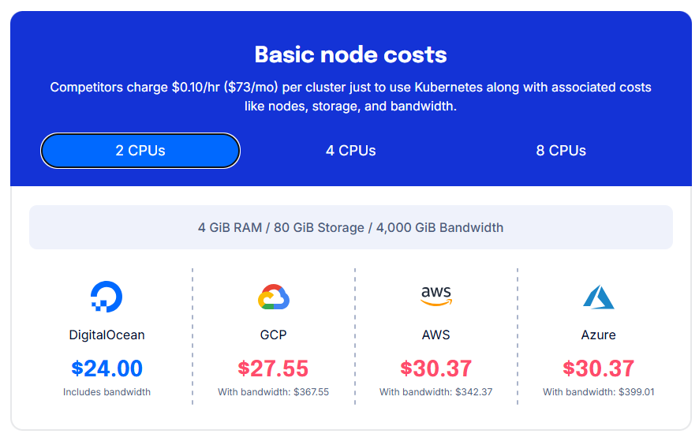

# 📊 Costos de Kubernetes en la Nube

## 🌐 Introducción

Kubernetes se ha convertido en el estándar de facto para la orquestación de contenedores. Sin embargo, su adopción en entornos de nube pública implica costos que van más allá del uso de los nodos de cómputo. Este documento resume los costos básicos asociados a ejecutar clústeres de Kubernetes en proveedores de nube populares, con énfasis en la comparación de precios según el recurso y proveedor.

## 🧾 Componentes que generan costos

Al desplegar Kubernetes en la nube, los costos generalmente se dividen en tres categorías:

1. **Nodos de cómputo (worker nodes):** instancias virtuales que ejecutan contenedores.
2. **Recursos asociados al clúster:** almacenamiento, red, balanceadores, control plane (en algunos casos).
3. **Tráfico de salida (egress):** suele estar limitado en los planes gratuitos y puede incrementar significativamente los costos.

---

## 💸 Comparativa de costos base

Según [DigitalOcean](https://www.digitalocean.com/products/kubernetes), el costo base para un nodo con:

* 2 vCPUs
* 4 GiB RAM
* 80 GiB de almacenamiento
* 4000 GiB de ancho de banda

| Proveedor                     | Precio Base Mensual | Costo con Ancho de Banda | Observaciones                                         |
| ----------------------------- | ------------------- | ------------------------ | ----------------------------------------------------- |
| **DigitalOcean**              | \$24.00             | \$24.00                  | Incluye ancho de banda en el precio                   |
| **Google Cloud (GCP)**        | \$27.55             | \$367.55                 | El ancho de banda representa un alto costo adicional  |
| **Amazon Web Services (AWS)** | \$30.37             | \$342.37                 | Tarifa competitiva, pero el ancho de banda es costoso |
| **Microsoft Azure**           | \$30.37             | \$399.01                 | Precio más alto con ancho de banda                    |

> 🔍 *Nota:* DigitalOcean destaca por ofrecer una estructura de costos predecible e incluir el tráfico de red dentro del valor base del nodo, lo cual puede ser ventajoso para pequeños proyectos o MVPs.

---

## ⚠️ Costos ocultos en Kubernetes gestionado

Dependiendo del proveedor, pueden existir costos adicionales por:

* **Control Plane:** en GKE (Google Kubernetes Engine) y EKS (AWS), puede haber cargos por el plano de control.
* **Load Balancers:** cada Ingress o Service tipo `LoadBalancer` puede crear un balanceador que incurre en costos mensuales por hora y por tráfico.
* **Almacenamiento dinámico:** volúmenes persistentes (`PersistentVolumes`) pueden generar costos separados por uso y por tipo de disco (HDD, SSD).
* **Logs y monitoreo:** herramientas como CloudWatch (AWS) o Stackdriver (GCP) generan costos según el volumen de logs recolectados.

---

## 💡 Recomendaciones para equipos técnicos

1. **Evaluar el caso de uso:** para entornos de desarrollo o pruebas, puede ser más económico usar soluciones como [K3s](https://k3s.io/) o clusters autogestionados en proveedores como Linode o DigitalOcean.
2. **Usar límites de recursos:** configura `requests` y `limits` en los `Pods` para evitar el sobreaprovisionamiento de recursos.
3. **Evitar exposiciones innecesarias:** cada LoadBalancer cuesta dinero. Usa Ingress Controllers con múltiples rutas si es posible.
4. **Automatizar apagado de entornos de staging/dev:** apagar entornos fuera del horario laboral reduce significativamente el gasto mensual.
5. **Monitorear tráfico de red:** el egress es una de las fuentes de costos menos visibles pero más peligrosas.

---

## ✅ Conclusión

El costo total de operar Kubernetes en la nube puede variar significativamente según el proveedor, la arquitectura del clúster y los patrones de tráfico. DigitalOcean ofrece una propuesta atractiva para entornos simples y proyectos pequeños, mientras que proveedores como AWS o GCP pueden ser más adecuados para cargas más complejas con necesidades específicas de escalabilidad o servicios gestionados.

Antes de adoptar Kubernetes en producción, es fundamental realizar un análisis de costos detallado alineado con los objetivos de negocio y carga esperada.

