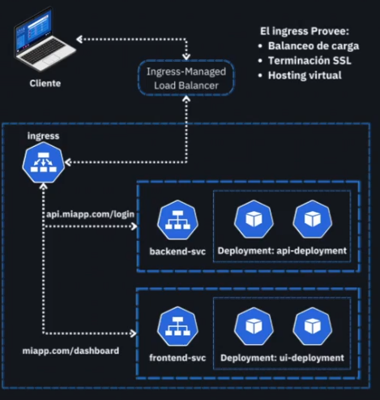

# 🌐 Introducción a Servicios e Ingress en Kubernetes

Cuando desplegamos aplicaciones en Kubernetes, necesitamos exponerlas y enrutar el tráfico adecuadamente. Para esto existen dos piezas fundamentales:

- **Services**, que se encargan de exponer los Pods dentro (o fuera) del clúster.
- **Ingress**, que permite controlar el acceso HTTP/HTTPS externo de manera flexible.

---

## 🧱 ¿Qué es un Service?

En Kubernetes, los Pods pueden cambiar su IP constantemente. Esto hace difícil referenciar aplicaciones de forma confiable. Aquí es donde entra el **Service**: una abstracción que proporciona una **IP y nombre DNS estables** para acceder a un grupo de Pods.

Un `Service` actúa como un "puente lógico" que:

- Agrupa varios Pods (usando `labels`).
- Expone una IP accesible dentro del clúster (o fuera, según el tipo).
- Hace **balanceo de carga interno** entre los Pods disponibles.

---

## ⚙️ Tipos de Service en Kubernetes

Cada tipo de `Service` resuelve una necesidad distinta de exposición y conectividad:

### 🔹 ClusterIP (por defecto)
- Exposición solo **interna** al clúster.
- Ideal para comunicación entre servicios backend.
- No accesible desde fuera del clúster.

### 🔸 NodePort
- Exposición **externa** a través de los nodos del clúster.
- Kubernetes abre un puerto (por defecto entre `30000–32767`) en **cada nodo**.
- Puedes acceder a tu app con `http://<NodeIP>:<NodePort>`.

### ⚪ LoadBalancer
- Utiliza un **balanceador de carga externo**, típicamente en nubes públicas.
- Asigna una IP pública única que enruta al `Service`.
- Ideal para producción en entornos como Azure, AWS o GCP.

### 🔗 ExternalName
- Mapea un nombre DNS externo (ej. `api.example.com`) a un nombre interno.
- No expone puertos, actúa como un alias para redirección.

---

## 🚪 ¿Por qué usar NodePort o LoadBalancer?

Cuando desarrollamos localmente (por ejemplo, con Minikube), `NodePort` es la forma más sencilla de acceder desde el navegador. Sin embargo, no es lo más flexible ni seguro.

Para entornos de producción o staging, la mejor práctica es usar un `LoadBalancer` o un `Ingress`.

---

## 🌍 ¿Qué es un Ingress?

Un **Ingress** es un recurso que define **reglas de enrutamiento HTTP/HTTPS** hacia los servicios del clúster.

Con Ingress puedes:

- Acceder a múltiples servicios bajo un mismo dominio.
- Usar rutas (ej. `/api`, `/auth`) para redirigir a diferentes backends.
- Configurar HTTPS/TLS fácilmente.
- Aplicar autenticación o control de tráfico.

🔧 **Importante:** Para que funcione necesitas instalar un **Ingress Controller** como:
- [NGINX Ingress Controller](https://kubernetes.github.io/ingress-nginx/)
- Traefik
- HAProxy

---

### 🧩 Componentes de la Arquitectura:

- **Cliente**: Navegador web o app externa que accede a la aplicación.
- **Load Balancer externo**: Provisión automática (ej. en nube) para acceder al clúster.
- **Ingress Controller**: Controlador que implementa las reglas definidas en el recurso `Ingress`.
- **Recurso Ingress**: Define cómo enrutar tráfico hacia los servicios internos.
- **Services internos**: `backend-svc` y `frontend-svc`, exponen Pods internamente.
- **Deployments**: Administran la creación y escalado de Pods del frontend y backend.

---

## ⚙️ ¿Qué provee un Ingress?

- ✅ **Balanceo de carga**
- ✅ **Terminación SSL**
- ✅ **Routing basado en rutas o subdominios**
- ✅ **Hosting virtual (virtual hosting)**

---

## 🧱 Arquitectura

---

## 🚀 Flujo de Trabajo

1. El cliente accede a `https://miapp.com/dashboard` o `https://api.miapp.com/login`.
2. La solicitud llega al Load Balancer (provisionado por Kubernetes).
3. Este redirige al Ingress Controller dentro del clúster.
4. El Ingress enruta la solicitud al servicio correspondiente (`frontend-svc` o `backend-svc`).
5. El servicio reenvía la solicitud al Pod adecuado (controlado por su Deployment).
6. El Pod responde al cliente a través del mismo flujo inverso.


## ✅ Recomendaciones

- Usa `ClusterIP` por defecto para comunicación interna.
- Usa `NodePort` solo en entornos locales o pruebas rápidas.
- Usa `Ingress` cuando:
  - Quieras centralizar el acceso HTTP.
  - Manejar múltiples rutas o dominios.
  - Aplicar TLS fácilmente.
- Usa `LoadBalancer` si estás en la nube y necesitas una IP pública directa.

---

## 📌 Conclusión

- Los `Services` permiten exponer y balancear tráfico a tus Pods.
- `Ingress` añade control inteligente sobre el tráfico HTTP/HTTPS externo.
- Juntos forman la base para arquitecturas modernas, seguras y escalables en Kubernetes.

```
