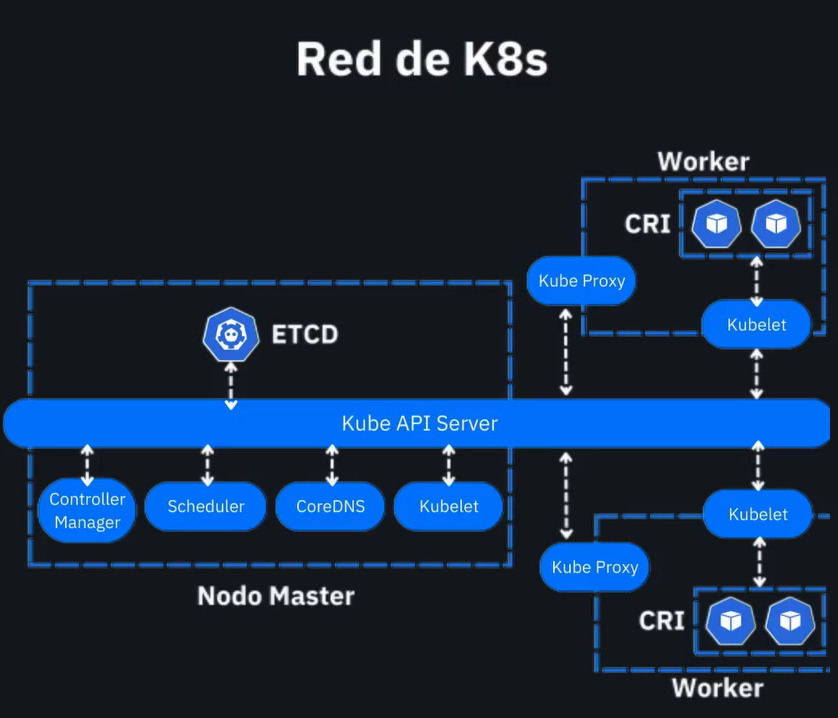
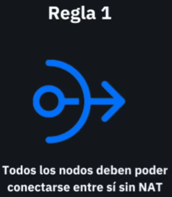
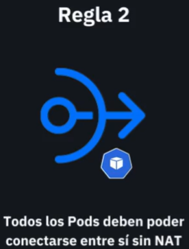
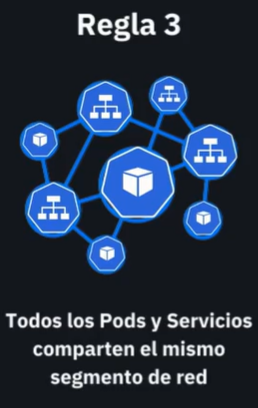

# 🌐 Networking en Kubernetes

Este documento explica la arquitectura de red mostrada en el diagrama titulado **"Red de K8s"**, desglosando los componentes clave involucrados en la comunicación dentro de un clúster de Kubernetes.

## 🧩 Componentes Principales

### 🔹 Nodo Master

El nodo master se encarga de la **orquestación y control** del clúster. Sus componentes clave son:

- **Kube API Server**: Punto central de comunicación para todos los componentes del clúster. Expone la API de Kubernetes.
- **ETCD**: Almacén de datos distribuido que guarda todo el estado del clúster.
- **Controller Manager**: Ejecuta controladores que responden a eventos y aseguran el estado deseado.
- **Scheduler**: Asigna los pods a nodos disponibles.
- **CoreDNS**: Provee resolución de nombres DNS para los servicios del clúster.
- **Kubelet**: (También aparece en el master) Administra los pods en el nodo donde se ejecuta.

### 🔹 Nodo Worker

Son los nodos donde corren los **Pods**, es decir, las cargas de trabajo reales. Cada worker incluye:

- **Kubelet**: Agente que se comunica con el API Server y administra los contenedores del nodo.
- **Kube Proxy**: Gestiona las reglas de red y balanceo de carga entre Pods y Servicios.
- **CRI (Container Runtime Interface)**: Capa de abstracción sobre el runtime de contenedores (por ejemplo, containerd o Docker).

## 🔄 Flujo de Comunicación

1. **El `Kube API Server` es el punto central de control**. Todos los componentes, tanto del master como de los workers, interactúan con él.
2. **ETCD** almacena el estado deseado y actual del clúster.
3. **Kubelet en cada nodo** se conecta al API Server para obtener instrucciones (por ejemplo, qué pods ejecutar).
4. **Kube Proxy** implementa reglas de red (iptables o IPVS) que permiten la comunicación entre Pods y Servicios.
5. **CRI** ejecuta los contenedores físicos según lo que indique el Kubelet.

## 🛰️ Comunicación entre Pods

Kubernetes asume un modelo de red plano, donde:
- Todos los Pods pueden comunicarse entre sí sin NAT.
- Los Pods pueden comunicarse con los Servicios.
- Los Servicios pueden abstraer múltiples Pods (via selector).

Este modelo se apoya en soluciones CNI (Container Network Interface) como Calico, Flannel o Cilium, que configuran el enrutamiento de red en los nodos.

## 🧠 Resumen Visual del Diagrama

| Componente        | Función                                               |
|-------------------|--------------------------------------------------------|
| Kube API Server   | Canal de control central                              |
| ETCD              | Base de datos distribuida para el estado del clúster  |
| Kubelet           | Controlador de ejecución de contenedores              |
| Kube Proxy        | Controla tráfico de red en cada nodo                  |
| CRI               | Ejecuta contenedores                                  |
| CoreDNS           | Resolución de nombres DNS en el clúster               |
| Scheduler         | Decide en qué nodo correr cada pod                    |
| Controller Manager| Mantiene el estado deseado del clúster                |

---

## 🔄 Reglas del Modelo de Red en Kubernetes

Kubernetes define tres reglas principales que deben cumplirse en su modelo de red. Estas reglas son respetadas por los CNI (Container Network Interface) como Flannel, Calico o Cilium.

### ✅ Regla 1: Comunicación entre nodos sin NAT

> Todos los nodos del clúster deben poder comunicarse entre sí sin traducción de direcciones (NAT).

Esto asegura que los componentes del sistema y los pods puedan intercambiar información de manera directa y eficiente.

---

### ✅ Regla 2: Comunicación entre pods sin NAT

> Todos los pods deben poder comunicarse entre sí sin requerir NAT, sin importar en qué nodo estén ejecutándose.

Esto permite que microservicios, sidecars y controladores puedan trabajar de forma distribuida y fluida.

---

### ✅ Regla 3: Espacio de red compartido entre Pods

> Todos los Pods en un nodo comparten el mismo espacio de red que el nodo. Esto significa que un Pod puede comunicarse con otros servicios del nodo a través de `localhost`.

Por eso los contenedores dentro de un Pod pueden comunicarse entre sí vía `localhost`.

---

## ✅ Conclusión

La red de Kubernetes está diseñada para ser extensible y modular, permitiendo que los Pods y Servicios se comuniquen de forma transparente, incluso si están en nodos distintos. Este diseño facilita la escalabilidad y resiliencia de las aplicaciones en producción.
