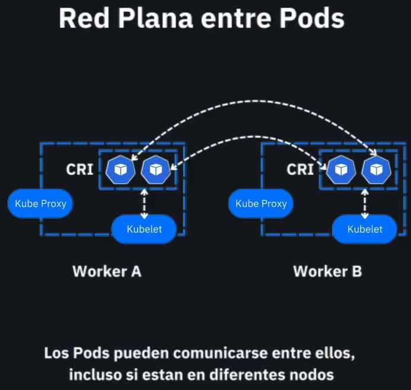

# 📡 Networking entre Pods en Kubernetes



## 🧠 ¿Qué representa el diagrama?

El diagrama muestra cómo funciona la **comunicación entre Pods** en un clúster de Kubernetes bajo el modelo de **Red Plana**.

Este modelo garantiza que **todos los Pods pueden comunicarse entre sí directamente usando direcciones IP**, incluso si están en **nodos (workers) diferentes**.

---

## 🧩 Componentes del diagrama

* **Worker A / Worker B**: Nodos del clúster de Kubernetes que ejecutan Pods.
* **CRI (Container Runtime Interface)**: Es la capa que permite a Kubernetes interactuar con el runtime de contenedores (por ejemplo, containerd o CRI-O). Es responsable de iniciar y administrar los contenedores.
* **Kubelet**: Es el agente que corre en cada nodo y se encarga de comunicar el estado del nodo y sus Pods al plano de control, además de garantizar que los contenedores estén corriendo correctamente.
* **Kube Proxy**: Implementa las reglas de red necesarias para la conectividad del clúster y el balanceo de carga dentro de los Services.

---

## 🔁 Comunicación entre Pods

1. Cada Pod en Kubernetes recibe una **dirección IP única** dentro del clúster.
2. Kubernetes crea una red virtual que conecta todos los Pods sin necesidad de NAT (Network Address Translation).
3. Los Pods pueden **comunicarse directamente** entre sí usando sus direcciones IP internas.
4. Esta comunicación ocurre aunque los Pods estén en **nodos distintos**, como se muestra en el diagrama (Worker A ↔ Worker B).

---

## 📦 ¿Por qué es importante esto?

* Facilita el diseño de aplicaciones distribuidas y microservicios.
* Simplifica la configuración de red porque no necesitas manejar NAT entre Pods.
* Permite escalar horizontalmente los Pods en distintos nodos sin preocuparse por cómo se comunicarán entre ellos.

---

## 🧪 Prueba de conectividad entre Pods

Puedes probar si las reglas se están cumpliendo con un pequeño test:

```bash
kubectl run pod-a --image=busybox --restart=Never -- sleep 3600
kubectl run pod-b --image=busybox --restart=Never -- sleep 3600

# Obtener IP de pod-b
kubectl get pod pod-b -o wide

# Desde pod-a hacer ping a pod-b
kubectl exec -it pod-a -- ping <IP-DE-POD-B>
```
---

## 📘 Notas adicionales

* El modelo de red plana es posible gracias a un **CNI (Container Network Interface)** como Calico, Flannel, Cilium, entre otros.
* Este modelo es **una de las garantías que da Kubernetes**: *"todos los Pods pueden comunicarse entre ellos sin necesidad de configuraciones adicionales de red"*.

